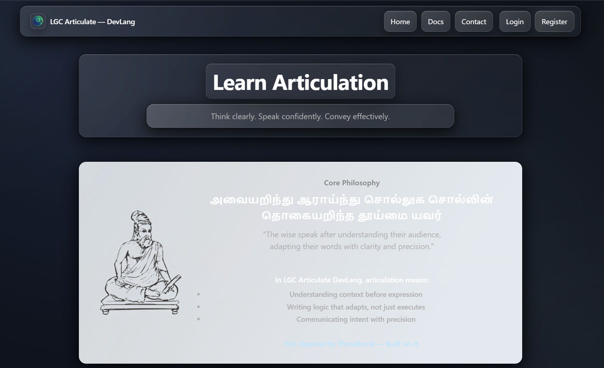

# 🌿 LGC Articulate — DevLang



---

## 🧠 Core Idea

> **Not inspired by Thirukkural — Built on it.**

> *அவையறிந்து ஆராய்ந்து சொல்லுக சொல்லின்*
> *தொகையறிந்த தூய்மை யவர்* — Thirukkural 711

> *"The wise speak after understanding their audience,*
> *adapting their words with clarity and precision."*

---

## 🎯 What is LGC Articulate?


**LGC Articulate — DevLang** is a full-stack communication coaching system designed to help users:

* Think before they speak
* Structure their responses
* Communicate with clarity, ownership, and precision

This is **not a chatbot**.
It is a **guided system for articulation training and evaluation**.

---

## 🧩 Core Modes

### 🟢 Learn Mode

* Scenario-based guided learning
* Step-by-step articulation breakdown
* Teaches *how to think and respond*

---

### 🔵 Evaluate Mode

* AI-powered scoring of responses

* Structured feedback:

  * Score
  * Breakdown
  * Strength
  * Gap
  * Improve

* Tracks attempt history for progress

---

### 🟣 Doubt Mode

* AI coaching for uncertain responses
* User provides context + intent
* System refines thinking, not just answers

---

## ⚙️ System Architecture

### 🖥️ Frontend

* React + Vite
* Feature-first structure
* Local state + custom hooks

```
client/src/
  features/
    learn/
    evaluate/
    doubt/
    auth/
  shared/
  services/
```

---

### 🧠 Backend

```
route → middleware → controller → service → model/utils
```

* Express.js
* MongoDB (Mongoose)
* JWT Authentication
* AI orchestration layer

---

### 🤖 AI Layer

* Structured prompt system
* Model fallback pipeline (`attemptStack`)
* Output validation (`aiGuard`)

---

## 🔗 API Overview

### 🌐 Public Routes

* `GET /health`
* `POST /api/auth/signup`
* `POST /api/auth/login`
* `POST /api/auth/forgot-password`
* `POST /api/auth/reset-password`
* `POST /api/doubt`

---

### 🔐 Protected Routes

* `POST /api/evaluate`
* `GET /api/evaluate/user/history`
* `GET /api/evaluate/:attemptId`

---

## 🧪 Tech Stack

Frontend:

* React
* React Router
* Vite

Backend:

* Node.js
* Express
* MongoDB + Mongoose
* JWT Authentication
* Brevo Email Service

AI:

* OpenRouter / Gemini

---

## 🚀 Local Setup

```bash
cd server
npm install

cd ../client
npm install
```

---

```bash
cd server
copy .env.example .env
```

---

```bash
npm run dev
```

---

```bash
cd ../client
npm run dev
```

---

Frontend: http://localhost:5173
Backend: http://localhost:3000

---

## 🧠 Design Philosophy

* Context before response
* Structure before expression
* Clarity over verbosity

> ❌ Raw answers → ✅ Structured articulation

---

## 📚 Documentation

* QUICKSTART.md
* ARCHITECTURE.md
* SYSTEM_MAP.md
* EXAMPLES.md

---

## ⚠️ Known Limitations

* Response format inconsistency
* Hardcoded API base URL
* Schema inconsistencies

---

## 🛣️ Future Direction

* Unified API response structure
* Better evaluation parsing
* Improved UX flows
* Mobile optimization

---

## 📜 License

Proprietary — All rights reserved. Unauthorized use is prohibited.

---

## ❤️ Final Note

This is not just a project.

It is a system built on a principle written over 2000 years ago —
to teach not just *what to say*, but *how to think before saying it*.

---

## 🛡️ Ownership

This software system is an original product developed under **LGC Systems**.

The ideation, system architecture, design, and overall product vision originate from
**Ramalingam Jayavelu**, Founder of LGC Systems.

All intellectual property belongs exclusively to **LGC Systems**.
