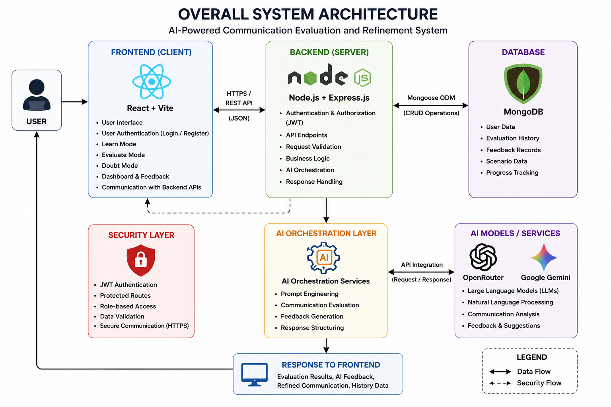
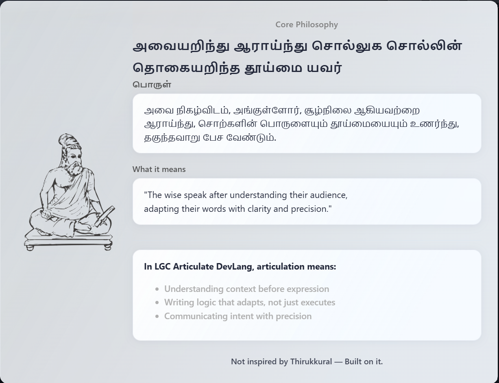
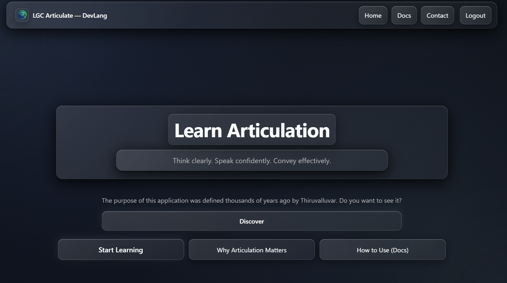
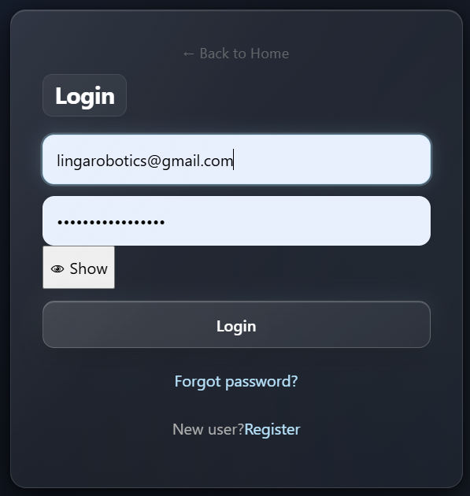
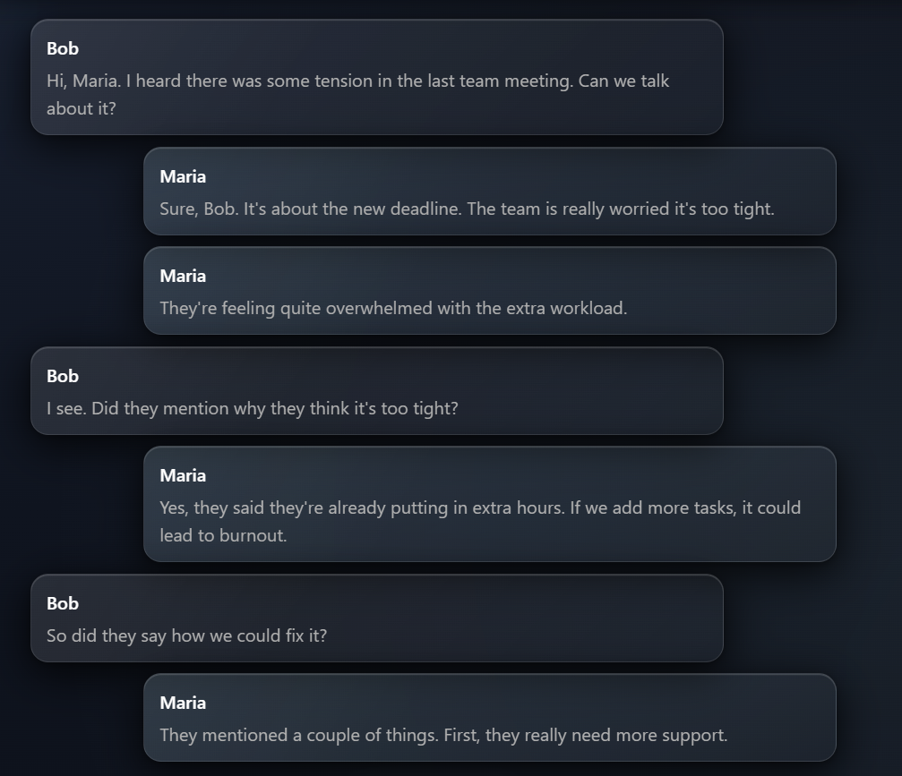
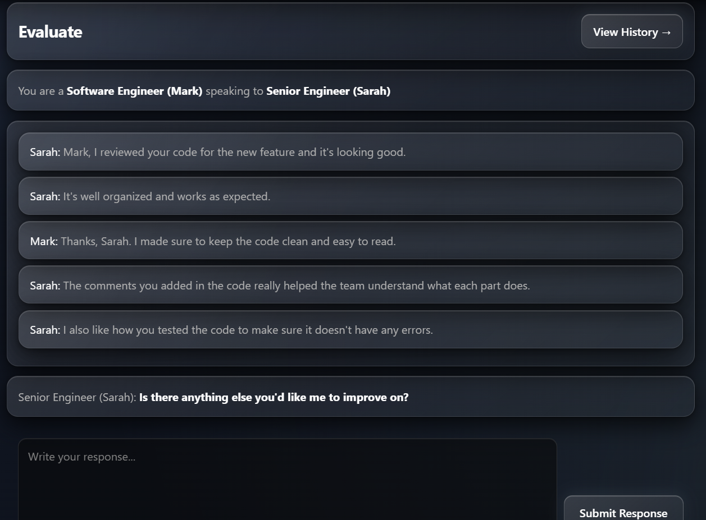
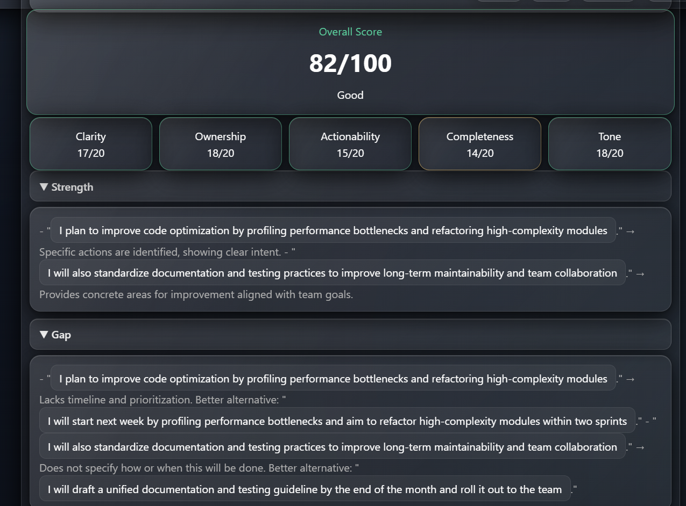
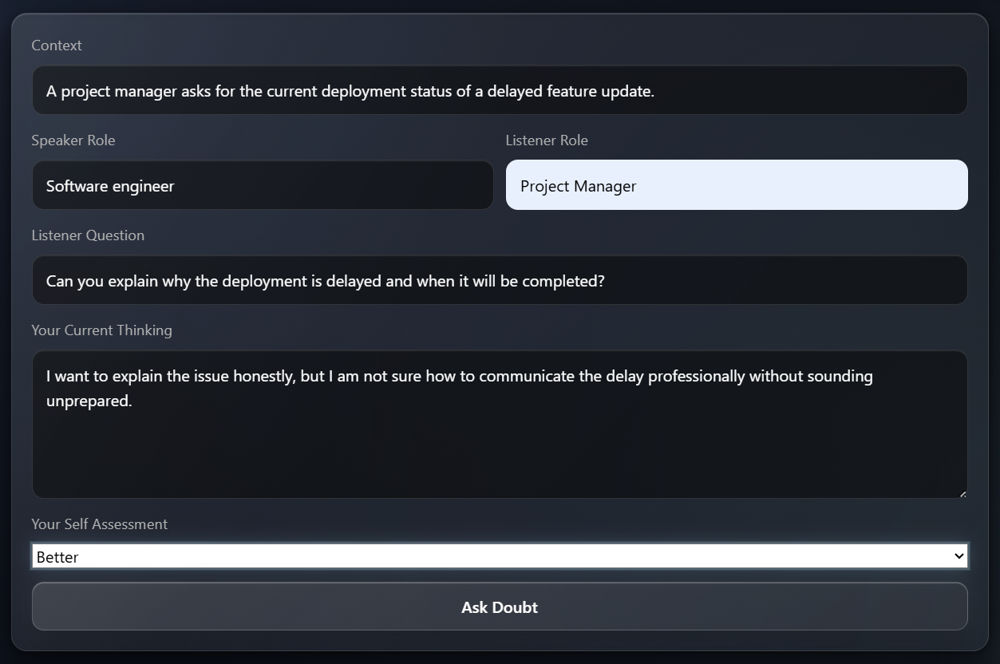

## Systems Report

LGC Articulate DevLang is an AI-assisted communication training and evaluation system focused on articulation improvement, structured thinking, contextual communication, and guided response refinement.

The system integrates:
- React + Vite frontend architecture
- Node.js + Express backend workflows
- MongoDB persistence
- JWT authentication
- AI-assisted evaluation pipelines
- Defensive validation workflows
- Scenario-based communication learning

This repository also contains the complete engineering systems report including:
- architecture design
- implementation workflows
- communication evaluation pipeline
- frontend-backend integration
- AI orchestration reasoning
- screenshots and system modules

---

## Systems Report PDF

[View Systems Report](./LGC-Articulate-DevLang-Systems-Report.pdfLGC-Articulate-DevLang-Systems-Report.pdf)

---

## Architecture & Workflow Assets

### Overall Architecture

### Core Philosophy

### Application Screenshots

#### Home Page

#### Login Interface

#### Learn Mode

#### Evaluation Mode

#### AI Evaluation

#### Doubt Mode

---

## Core Philosophy

This system is conceptually inspired by:

> “அவையறிந்து ஆராய்ந்து சொல்லுக சொல்லின்  
> தொகையறிந்த தூய்மை யவர்”

— Thirukkural 711

The project focuses on helping users improve:
- articulation quality
- structured communication
- contextual understanding
- professional response generation
- intentional communication thinking

through AI-assisted evaluation and guided workflows.

---

## Engineering Focus Areas

- Systems Thinking
- Communication Intelligence
- AI-Assisted Evaluation
- Backend Architecture
- Full-Stack Workflow Design
- Defensive Validation
- Intentional Learning Systems

---

## Author

Ramalingam Jayavelu  
Founder & Builder — LGC Systems